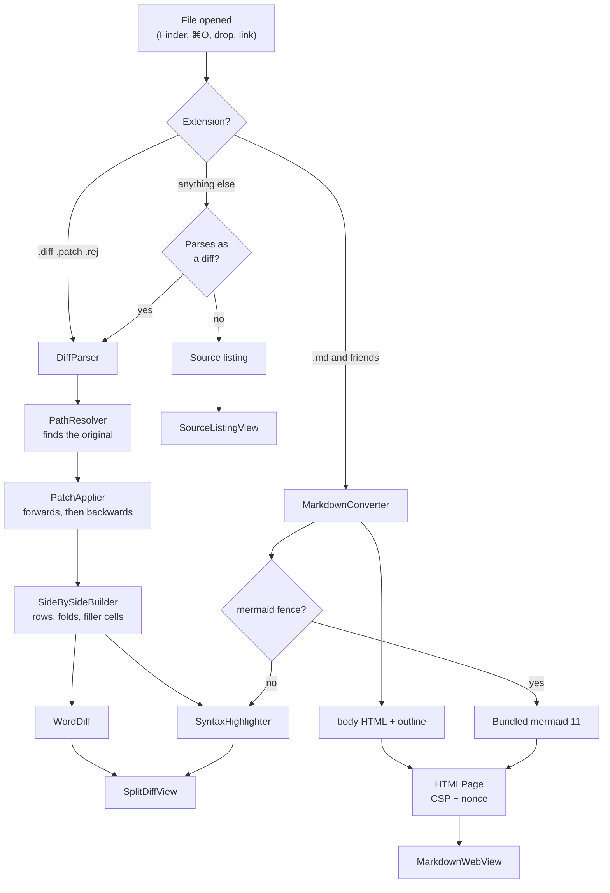

# How Folio is built

This is the "why" companion to the code. If you only need the map of files, that is in
[CONTRIBUTING.md](../CONTRIBUTING.md#the-layout-of-the-code).

## The path a file takes

Everything above the view layer is a pure function of its inputs, which is why nearly all
of the 183 tests live there and none of them need a window.

## Decisions worth knowing about

### Diffs are applied, not trusted

A unified diff contains the changed lines but not the changed *file*. Folio reads the
original from disk and applies the patch **in memory** to produce the right-hand panel.
Nothing is written back, so there is no state to get out of sync and no way for a
malformed diff to damage anything.

Hunks are located by **content**, not by the line numbers in the `@@` header, searching
outward from the declared position and falling back to whitespace-insensitive matching and
then to `patch`-style fuzz. Real diffs drift.

### The file on disk is often the *new* version

The common case in practice — someone sends you a patch that has already been applied, or
a tool generates the diff after writing the file — used to show as "hunk #1 does not match
the original". So when forward application fails, `PatchApplier.reverse` runs the patch
**backwards** to reconstruct the original exactly, and the normal forward path then runs
over that result so the row alignment comes from one code path rather than two. A banner
tells the reader which happened. Only when neither direction applies does Folio fall back
to showing the hunks alone.

### One window, with tabs

Folio uses SwiftUI's single `Window` scene rather than `WindowGroup`. `WindowGroup` mints
a new window every time Launch Services asks the app to open a file, which produced a
duplicate window per double-click. A single window also matches what the app is: a place
to look at documents, not a document-based editor.

That makes tabs the answer for multiple files, which in turn forces the state split:
**everything belonging to one document lives on `DocumentTab`** — reading mode, folds,
scroll offsets, search results, its render cache and its web view. `AppState` keeps the
tab list, the shared find bar and window preferences, and exposes forwarding accessors
(`state.files`, `state.textDocument`, …) so views can still be written against "the
current document". Observation tracks the access through the forwarding property onto the
tab, so this costs nothing in correctness.

### Rendered pages stay alive

Each Markdown tab owns a `MarkdownPageController` holding a live `WKWebView`. Switching
tabs re-parents that view instead of rebuilding it, which preserves the scroll position
and — more visibly — keeps mermaid diagrams drawn rather than re-drawing them.

Each live page is a separate WebContent process holding a parsed copy of mermaid, so at
most five stay loaded; the least recently shown are torn down. Nothing is lost when they
are: the page reports its scroll offset as the reader scrolls, so a reloaded page is put
back in place — re-applied once mermaid reports in, because diagrams change the page
height.

### Editing is a draft beside the document

A tab holds the parsed `TextDocument` — lines, spans, outline, converted HTML — and,
once you type, a `draftText` beside it. Dirty is simply "draft differs from the text the
document was parsed from", so reverting is dropping the draft and saving is promoting it.

The parse is deliberately *not* redone on every keystroke: the editor only updates the
draft, and the document is rebuilt when the preview is asked for, or on save. Colouring
the text view is separate and debounced by 180 ms.

Two details protect the file. Writing goes through `Data.write(options: .atomic)`, so an
interrupted save cannot leave a half-written document. And before overwriting, the file is
re-read and its **text** compared with the text the document was parsed from.

Comparing content rather than a modification date is both more accurate and, for documents
of ordinary size, cheaper. A timestamp misses a write that lands within the same second
and is fooled by tools that preserve dates, while raising false alarms for `touch` or a
rewrite of identical bytes. Measured on this machine: reading and comparing a 16 KB file
takes ~14 µs, where merely asking for its attributes takes ~63 µs.

Hashing would be strictly worse. The bytes have to be read either way, so a digest is the
read *plus* a pass over the data — 19 µs against 14 µs at 16 KB, 376 µs against 57 µs at
1 MB — and the text to compare against is already in memory for the dirty check. Hashing
earns its keep when the baseline is *not* held, such as watching many files at once.

### Git is a subprocess, not a library

Folio runs the `git` already on the machine rather than linking libgit2. The reason is not
effort saved: it is that the reader's `~/.gitconfig`, credential helper, SSH agent,
`pre-commit` hook and signing key all come along, so a commit Folio makes is
indistinguishable from one they made in a terminal. A linked library would reimplement
each of those, badly, and would be this project's second dependency.

Three details that a subprocess forces you to get right:

- **`GIT_TERMINAL_PROMPT=0`.** A push whose stored credentials have expired would otherwise
  wait for ever at a terminal that does not exist. With prompting off it fails at once and
  the failure can be shown.
- **Both pipes are drained while the child writes.** A pipe buffer is 64 KB; waiting on
  stdout while stderr fills deadlocks the child, and `git push --verbose` writes that much.
  The draining uses `readabilityHandler` rather than a blocking read per pipe, because the
  blocking version ties up three threads per command — dropping a couple of dozen
  documents onto Folio at once was enough to threaten GCD's pool.
- **`PATH` is extended.** An app launched from Finder inherits launchd's short `PATH`, so
  a credential helper installed by Homebrew is not on it and the same push that works in
  Terminal fails here.

### Only two things are written to a repository

`GitRepository` exposes exactly two write paths, and neither takes an argument that could
widen it: commit one named file, and push the current branch to the upstream it already
tracks.

The commit is narrowed by a pathspec — `git commit -- <path>` — so whatever else the
reader has staged stays staged. `git add` runs first only because a file git has never
seen cannot be named in a commit pathspec. The save runs before the commit, since git
records what is on disk and committing an unsaved buffer would store the wrong version;
if the reader cancels at the overwrite prompt, the commit is cancelled with it.

The push is spelled `HEAD:refs/heads/<name>` rather than a bare `git push`, so it does not
depend on the reader's `push.default` and cannot be redirected by it. Nothing forces,
pulls, merges, rebases, resets or checks out. A rejected push is reported as it stands —
the commit is already made, which the message says, because the reader has not lost
anything and needs to know that before they start fixing it.

This is the one place Folio uses the network, and it is always a button someone pressed.

### Watching a file means re-opening it, not holding it

A `DispatchSource` file-system watcher holds a file descriptor. That works for a program
writing *into* a file, and not at all for the way almost everything actually writes one:
a temporary file alongside, renamed over the top. After the rename the descriptor refers
to an unlinked inode that will never change again, so the watcher goes quiet and stays
quiet. Folio's own saves work this way, which makes it easy to test and easy to miss —
the first change is reported, and every one after it is lost.

`FileWatcher` therefore treats `.delete`, `.rename` and `.revoke` as instructions to tear
down and re-open the path, with a few short retries to cover the gap. A test replaces the
file three times and requires all three to arrive; with the re-arming removed it fails on
the second, which is how the behaviour was confirmed rather than assumed.

Two smaller decisions. Events are coalesced over 120 ms, because one logical write is
rarely one syscall. And the watcher reports only that *something* happened — whether
anything differs is decided by reading the file and comparing the text, the same test
that guards an overwrite, which is what stops `touch` and Folio's own saves from
announcing themselves.

### The one diff Folio computes

Everywhere else, a diff arrives: from a patch file, or from git. Comparing a buffer in
memory against the file on disk has no such source, so `LineDiff` works it out.

It trims the common prefix and suffix first, then runs an LCS over what is left. The
trimming is not only an optimisation — a rewritten paragraph in a four-thousand-line note
leaves a middle of a few lines, which is the difference between a table worth building and
one that is not. Past a ceiling on the remaining product, the differing region is reported
as wholly replaced and the view says so, rather than spending seconds proving it.

The trimmed ends go back on as unchanged operations before the hunks are grouped. Leaving
them off looks right and is not: the lines immediately around a change are its context,
and a hunk without them has nothing to anchor to. Both bugs — the missing context and the
resulting misplacement — were caught by a test that applies the computed hunks back to the
original and requires the updated file out, which is the only definition of correct that
matters here.

### History reuses the diff pipeline rather than describing it again

A commit's change to a file is a unified diff plus the content it was made against. That
is exactly the pair `DiffPreparation` already takes, so showing a commit needed no new
view, no new row model, no new alignment, and no new highlighting — git supplies the two
inputs and the existing pipeline does the rest. Word diffing, collapsible context, ⌘F and
scroll memory came along without being asked for.

`DiffPreparation.prepare(change:)` is markedly shorter than its sibling that reads a patch
file, and the reason is instructive: git removes every ambiguity that makes the other one
long. The content going in comes from the repository rather than from a file on disk that
might be the original, might be the patched version, or might be some third revision — so
there is no reconstruction, no reversing the patch to recover the original, and no
guessing.

Two details:

- **The path travels with the commit.** `git log --follow` crosses renames, which prose
  files collect, and `git show` needs the name the file had *then*, not now. Each entry in
  the list therefore carries its own path.
- **`rawOldPath` is not a path.** It still has git's `a/` prefix, which belongs to the
  diff's grammar rather than to the repository. Asking for `a/note.md` finds nothing, and
  because a missing parent is how the commit that *added* a file is detected, the mistake
  does not error — it silently reports every commit as the file's first. A test caught it.

A commit is shown in place of the document rather than in a new tab, so the list stays
beside it and stepping back through a file's past is one click per step.

### The outline is a tree, inferred not declared

`OutlineLayout` nests headings by their level *relative to their neighbours*, not by the
number of `#`. Real documents skip levels — an `H1` followed by an `H3` is still a parent
and its child — and plenty start at `H2`, which should sit at the top rather than indented
under nothing. A stack of still-open headings gives both for free, and the depth it yields
is what the sidebar indents by and what "show two levels" counts.

### Reopening is lazy

The session — paths, tab order, which was in front, reading mode, scroll offsets — is a
small JSON blob in `UserDefaults`, written on every change that alters it and once more on
quit, because scroll positions only move between those points.

Restoring creates **placeholder tabs**: a URL, and the kind guessed from the extension,
which is enough to draw the tab bar. Only the document in front is read; the rest fill
themselves in when first shown. Reading and converting every document up front was
measured at 43 ms each — over a second for a full set — against 2 ms for a placeholder.

The consequence to watch for: any route that changes which tab is in front has to read it
first. They all funnel through one `setActive`, which is what stops a closed tab promoting
an unread neighbour and showing the welcome screen.

### Scroll positions come from AppKit

SwiftUI on macOS 14 cannot read or set a scroll offset. `ScrollOffsetKeeper` is a
zero-sized `NSViewRepresentable` placed inside the `ScrollView`; it reaches the backing
`NSScrollView`, records the offset on every bounds change and replays it when the view
reappears. Positions are keyed per view, so a diff remembers a separate position for each
of its files, and a Markdown document remembers rendered and source independently.

The first restore attempt is synchronous, inside the same layout pass, so there is no
visible jump from the top; asynchronous retries handle a `LazyVStack` that has not yet
grown tall enough to reach the target.

### Markdown is converted in Swift

The converter is ~700 lines of Swift rather than a bundled JavaScript library. That keeps
it unit-testable, lets code fences reuse the same lexer the diff panels use — so `swift`
looks identical in a fence and in a diff — and means mermaid remains the *only*
third-party code in the project.

Raw HTML is **escaped**, except a whitelist of attribute-free formatting tags (` `,
`<b>`, `
`, `<kbd>`, …). A viewer should never execute markup it was handed, and
"just render it" is how a document turns into an attack. `javascript:` and similar schemes
are stripped from links, local images are inlined as `data:` URIs, and remote images are
reported rather than fetched.

### The page is sandboxed by CSP

`HTMLPage` emits `default-src 'none'; connect-src 'none'; img-src data: blob:;
script-src 'nonce-…'`. The bundled mermaid bootstrap is admitted by that per-load nonce
and nothing else can run. mermaid needs `'unsafe-eval'`, which is granted only for
documents that actually contain a diagram.

### Search works differently in each view

Diffs and source listings are native views, so ⌘F searches the model and highlights
ranges. The rendered page is a web view, so search is injected JavaScript that wraps hits
in `<mark>` and reports the count back. One subtlety, learned the hard way: mermaid injects
`<style>` **inside** the SVG, and SVG tag names are lower case, so a naive `'STYLE'` check
counted 131 CSS matches as document hits.

### Everything is verified without Xcode

The development machine has the Command Line Tools only, no screen-recording permission,
and therefore no screenshots. That shaped the verification approach, which is worth
keeping:

- **Model logic** — ordinary tests, run against real fixtures in `Samples/`.
- **SwiftUI views** — rasterised offscreen with `ImageRenderer`. `ScrollView` and `List`
  render blank, so the inner content stack is rendered instead.
- **The rendered page** — `WKWebView.takeSnapshot` from an invisible `NSWindow`, which
  needs no permissions and captures real JavaScript output, diagrams included.
- **Windows and associations** — `CGWindowListCopyWindowInfo` for window titles and sizes,
  and Launch Services probe files for "which app would open this".

Several genuine bugs came out of that last category rather than from the unit tests,
including a false-negative association check caused by Launch Services' per-process cache.
