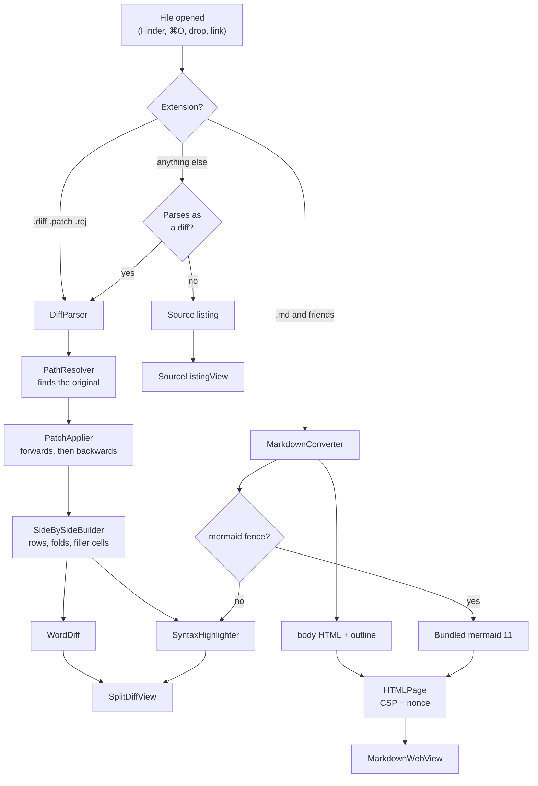

# How Folio is built

This is the "why" companion to the code. If you only need the map of files, that is in
[CONTRIBUTING.md](../CONTRIBUTING.md#the-layout-of-the-code).

## The path a file takes

Everything above the view layer is a pure function of its inputs, which is why nearly all
of the 109 tests live there and none of them need a window.

## Decisions worth knowing about

### Diffs are applied, not trusted

A unified diff contains the changed lines but not the changed *file*. Folio reads the
original from disk and applies the patch **in memory** to produce the right-hand panel.
Nothing is written back, so there is no state to get out of sync and no way for a
malformed diff to damage anything.

Hunks are located by **content**, not by the line numbers in the `@@` header, searching
outward from the declared position and falling back to whitespace-insensitive matching and
then to `patch`-style fuzz. Real diffs drift.

### The file on disk is often the *new* version

The common case in practice — someone sends you a patch that has already been applied, or
a tool generates the diff after writing the file — used to show as "hunk #1 does not match
the original". So when forward application fails, `PatchApplier.reverse` runs the patch
**backwards** to reconstruct the original exactly, and the normal forward path then runs
over that result so the row alignment comes from one code path rather than two. A banner
tells the reader which happened. Only when neither direction applies does Folio fall back
to showing the hunks alone.

### One window, with tabs

Folio uses SwiftUI's single `Window` scene rather than `WindowGroup`. `WindowGroup` mints
a new window every time Launch Services asks the app to open a file, which produced a
duplicate window per double-click. A single window also matches what the app is: a place
to look at documents, not a document-based editor.

That makes tabs the answer for multiple files, which in turn forces the state split:
**everything belonging to one document lives on `DocumentTab`** — reading mode, folds,
scroll offsets, search results, its render cache and its web view. `AppState` keeps the
tab list, the shared find bar and window preferences, and exposes forwarding accessors
(`state.files`, `state.textDocument`, …) so views can still be written against "the
current document". Observation tracks the access through the forwarding property onto the
tab, so this costs nothing in correctness.

### Rendered pages stay alive

Each Markdown tab owns a `MarkdownPageController` holding a live `WKWebView`. Switching
tabs re-parents that view instead of rebuilding it, which preserves the scroll position
and — more visibly — keeps mermaid diagrams drawn rather than re-drawing them.

Each live page is a separate WebContent process holding a parsed copy of mermaid, so at
most five stay loaded; the least recently shown are torn down. Nothing is lost when they
are: the page reports its scroll offset as the reader scrolls, so a reloaded page is put
back in place — re-applied once mermaid reports in, because diagrams change the page
height.

### Scroll positions come from AppKit

SwiftUI on macOS 14 cannot read or set a scroll offset. `ScrollOffsetKeeper` is a
zero-sized `NSViewRepresentable` placed inside the `ScrollView`; it reaches the backing
`NSScrollView`, records the offset on every bounds change and replays it when the view
reappears. Positions are keyed per view, so a diff remembers a separate position for each
of its files, and a Markdown document remembers rendered and source independently.

The first restore attempt is synchronous, inside the same layout pass, so there is no
visible jump from the top; asynchronous retries handle a `LazyVStack` that has not yet
grown tall enough to reach the target.

### Markdown is converted in Swift

The converter is ~700 lines of Swift rather than a bundled JavaScript library. That keeps
it unit-testable, lets code fences reuse the same lexer the diff panels use — so `swift`
looks identical in a fence and in a diff — and means mermaid remains the *only*
third-party code in the project.

Raw HTML is **escaped**, except a whitelist of attribute-free formatting tags (` `,
`<b>`, `
`, `<kbd>`, …). A viewer should never execute markup it was handed, and
"just render it" is how a document turns into an attack. `javascript:` and similar schemes
are stripped from links, local images are inlined as `data:` URIs, and remote images are
reported rather than fetched.

### The page is sandboxed by CSP

`HTMLPage` emits `default-src 'none'; connect-src 'none'; img-src data: blob:;
script-src 'nonce-…'`. The bundled mermaid bootstrap is admitted by that per-load nonce
and nothing else can run. mermaid needs `'unsafe-eval'`, which is granted only for
documents that actually contain a diagram.

### Search works differently in each view

Diffs and source listings are native views, so ⌘F searches the model and highlights
ranges. The rendered page is a web view, so search is injected JavaScript that wraps hits
in `<mark>` and reports the count back. One subtlety, learned the hard way: mermaid injects
`<style>` **inside** the SVG, and SVG tag names are lower case, so a naive `'STYLE'` check
counted 131 CSS matches as document hits.

### Everything is verified without Xcode

The development machine has the Command Line Tools only, no screen-recording permission,
and therefore no screenshots. That shaped the verification approach, which is worth
keeping:

- **Model logic** — ordinary tests, run against real fixtures in `Samples/`.
- **SwiftUI views** — rasterised offscreen with `ImageRenderer`. `ScrollView` and `List`
  render blank, so the inner content stack is rendered instead.
- **The rendered page** — `WKWebView.takeSnapshot` from an invisible `NSWindow`, which
  needs no permissions and captures real JavaScript output, diagrams included.
- **Windows and associations** — `CGWindowListCopyWindowInfo` for window titles and sizes,
  and Launch Services probe files for "which app would open this".

Several genuine bugs came out of that last category rather than from the unit tests,
including a false-negative association check caused by Launch Services' per-process cache.
