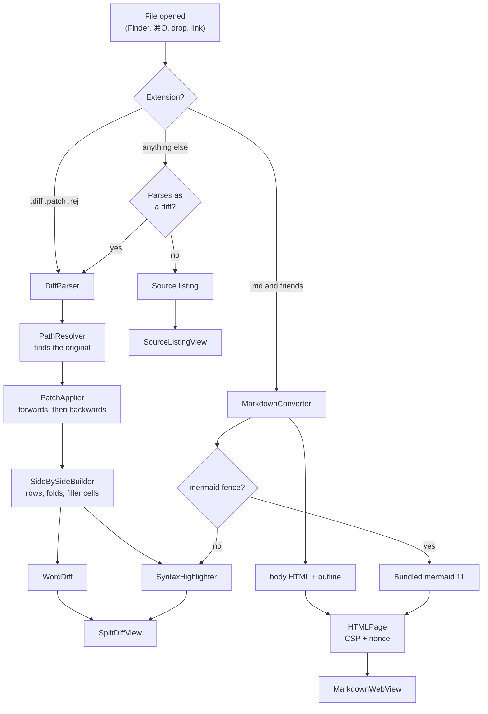

# How Folio is built

What the pieces are and how they fit together. The map of files is in
[CONTRIBUTING.md](../CONTRIBUTING.md#the-layout-of-the-code); the reasoning behind a
particular choice is in the commit that made it.

## The path a file takes

## The layers

| | Owns | Rule |
|---|---|---|
| `Model/` | Parsing, patching, diffing, conversion, git | Pure functions of their inputs. No UI, no `AppState`, fully tested. |
| `State/` | `AppState`, `DocumentTab`, and the actions on them | `@MainActor`. Everything belonging to one document lives on the tab. |
| `Views/` | SwiftUI and the AppKit/WebKit bridges | Assemble and display; compute nothing worth testing. |
| `App/` | The scene, the menus, the application delegate | Launch, Apple Events, file associations. |

## Documents and window state

Folio has a single SwiftUI `Window` scene, not a `WindowGroup`, so several files mean
tabs rather than several windows.

**`DocumentTab`** holds everything belonging to one document: files and selection for a
diff; `TextDocument`, reading mode and `draftText` for text; the outline's collapsed set;
per-view scroll offsets; search results; the git snapshot and history; the render cache
and the live web view.

**`AppState`** holds the tab list, the shared find bar, window preferences, and forwarding
accessors (`state.files`, `state.textDocument`, …) so views can be written against "the
current document". Observation tracks the access through the forwarding property onto the
tab.

`DocumentTab.pane` decides what the detail area shows: the document itself, a commit from
its history, an incoming change on disk, or what is not yet committed. The last three are
comparisons and share `ComparisonPane`.

**Groups.** `DocumentTab.group` is a name the reader filed the document under, or nil.
Nothing is inferred from the path. A document opened while a group is selected joins that
group — `adopt` is the one route new tabs take, so that is the one place it happens, and a
restored session goes through `adoptRestored` instead and keeps what it had. There is no registry — a group exists exactly as long as some open
document names it, so one cannot be left behind empty. `AppState.selectedGroup` filters
`visibleTabs`, which is what the tab bar, ⌃⇥ and Close Other Tabs work on. `setActive`
reveals the group of whatever tab comes forward, so the front document is never hidden by
the filter.

**Notes.** `Annotation` records a passage the reader marked up — its words, the source
lines, and what they wrote. Nothing is written to the document. A selection made in the
rendered view has lost the Markdown that produced it, so `AnnotationLocator` finds it in
the source by comparing words with markers stripped and whitespace flattened, ordered by
the line the block reported; the same reasoning as locating a hunk by content rather than
by its declared position. `AnnotationReport` renders the lot, reading the source at the
moment it is asked so the text quoted is the text as it stands.

The page reports its selection continuously rather than when the menu opens: AppKit builds
the context menu with no point at which the page can be asked a question and awaited, so by
the time the menu is wanted the app already knows. Blocks carry `data-line` — headings
always did, paragraphs now too — which is the hint the locator starts from and which narrows
the marking script to the blocks worth searching. The script marks the words themselves: it
flattens a block's text nodes into one string, finds the quote in it and wraps that range,
so a passage running across a link or a bold run is marked as one. A quote it cannot find —
a selection made in source mode, whose Markdown is not what the page renders — falls back to
tinting the block.

**Session.** Paths, tab order, which was in front, reading mode, scroll offsets and folds
are a JSON blob in `UserDefaults`. Restoring creates placeholder tabs — a URL and the kind
guessed from the extension — and only the document in front is read; the rest fill in when
first shown. Every route that changes the front tab therefore funnels through one
`setActive`, which reads it.

**`ScrollOffsetKeeper`** is a zero-sized `NSViewRepresentable` inside a `ScrollView` that
reaches the backing `NSScrollView`, since SwiftUI on macOS 14 can neither read nor set an
offset. Positions are keyed per view, so a diff remembers one per file and a Markdown
document remembers rendered and source separately.

## Diffs

**`DiffParser`** → `[FileDiff]`. **`PathResolver`** finds the original on disk.
**`PatchApplier`** locates hunks by *content* rather than by the `@@` line numbers,
searching outward from the declared position and falling back to whitespace-insensitive
matching and then to `patch`-style fuzz. It applies forward, and — when the copy on disk
is already the changed version — runs the patch backwards to reconstruct the original,
then forward again over that result so row alignment comes from one code path.

**`SideBySideBuilder`** produces rows, folds and filler cells; **`WordDiff`** highlights
the changed tokens within a modified pair; **`SyntaxHighlighter`** colours both sides.

Nothing is ever written back. The patch is applied in memory.

**`DiffPreparation`** turns an entry into a `LoadedFile`, from one of three sources:

- a file on disk, for an opened patch;
- a `GitHistory.Change` — a diff plus the content it was made against — for a commit, or
  for the repository-wide view via `FileEntry.committedOriginal`;
- two texts held in memory, compared by `LineDiff`.

**`LineDiff`** is the only diff Folio computes rather than reads; it exists because a
buffer compared against the file on disk has no patch to parse. It trims the common prefix
and suffix, runs an LCS over the middle, and re-attaches the trimmed ends as context before
grouping hunks. Past a ceiling on the remaining product it reports the region as wholly
replaced, and the view says so.

## Markdown

**`MarkdownConverter`** converts in Swift rather than through a bundled JavaScript
library, producing body HTML, the outline and a diagram count. Code fences reuse the same
lexer the diff panels use. Raw HTML is escaped apart from a whitelist of attribute-free
formatting tags; `javascript:` and similar schemes are stripped; local images are inlined
as `data:` URIs and remote ones are reported rather than fetched.

**`HTMLPage`** caps the text column at `readingWidth` and centres it, so a wide window
gives margins rather than long lines. It wraps the body with `default-src 'none'; connect-src 'none'; img-src data:
blob:; script-src 'nonce-…'`. Only the bundled mermaid bootstrap carries the per-load
nonce. `'unsafe-eval'`, which mermaid needs, is granted only to documents that contain a
diagram.

**`MarkdownPageController`** owns one live `WKWebView` per tab. Switching tabs re-parents
it rather than rebuilding, which keeps scroll position and drawn diagrams. Each page is a
separate WebContent process holding a parsed copy of mermaid, so at most five stay loaded
and the least recently shown are torn down; a torn-down page reports its scroll offset as
the reader scrolls and is put back in place on reload, re-applied once mermaid reports in.

The outline follows the reader. The rendered page reports the heading at the top of the
window as it scrolls; source mode has no page to ask, so the editor turns the topmost
visible line into a heading through `OutlineLayout.heading(atOrAbove:)`. Either way it
lands in `DocumentTab.visibleAnchor`, which marks the row and scrolls the sidebar the
least it can to keep it in sight.

**`OutlineLayout`** nests headings by their level relative to their neighbours rather than
by the number of `#`, so a document that skips levels or starts at `H2` still forms a
sensible tree. The depth it yields is what the sidebar indents by and what "show two
levels" counts.

## Editing

A tab holds the parsed `TextDocument` and, once you type, a `draftText` beside it. Dirty
is "draft differs from the text the document was parsed from", so reverting drops the
draft and saving promotes it.

The parse is not redone per keystroke: the editor updates the draft, and the document is
rebuilt when the preview is asked for or on save. Colouring the text view is separate and
debounced by 180 ms.

Writing goes through `Data.write(options: .atomic)`. Before overwriting, the file is
re-read and its text compared with the text the document was parsed from — content, not a
modification date.

## Git

**`Git`** runs the `git` on the machine as a subprocess, so the reader's config, credential
helper, SSH agent, hooks and signing key all apply. It sets `GIT_TERMINAL_PROMPT=0` so a
command can never wait at a terminal that does not exist, drains both pipes through
`readabilityHandler` while the child writes, extends `PATH` beyond launchd's, and applies a
timeout.

**`GitRepository`** reads status — branch, upstream, ahead/behind, the file's state and its
line counts — and exposes exactly two write paths, neither taking an argument that could
widen it:

- **commit one named file**, narrowed by a pathspec so anything else staged stays staged;
- **push the current branch** to the upstream it already tracks, spelled
  `HEAD:refs/heads/<name>` so `push.default` cannot redirect it.

Nothing forces, pulls, merges, rebases, resets or checks out. Push is the one place Folio
uses the network.

`GitSnapshot` carries the commit `HEAD` points at, so a refresh can tell the repository
moved underneath the reader — a pull, a commit made in a terminal, a branch switch. When it
has, the file's log is re-read if the list is on screen and dropped if it is not; a log read
once and kept forever describes a repository that no longer exists.

**`GitHistory`** spells repository-relative paths as `:(top,literal)…` pathspecs, since
git resolves a plain one against the working directory and Folio runs it beside the
document. It reads the log for one file (following renames, so each entry carries the
name the file had then), one commit's change to it, and the file's contents at a revision.
**`GitWorkingTree`** collects everything uncommitted in a repository as one diff, with
untracked files diffed individually against `/dev/null` so nothing has to be staged.

Git is offered for any document opened from a file, not only the ones Folio can edit.

## Watching the file

**`FileWatcher`** watches one path. On `.delete`, `.rename` or `.revoke` it tears down and
re-opens the path with short retries, because an atomic save replaces the inode and a held
descriptor would never fire again. Events are coalesced over 120 ms, and the watcher
reports only that something happened.

Most work on a repository never touches the file being shown, so the watcher has nothing
to report. `applicationDidBecomeActive` therefore re-reads the front document and its git
status whenever Folio comes back to the front. Both comparisons are against what is already
held, so an unchanged file and an unmoved `HEAD` cost a read and change nothing.

The `AppState` extensions in **`ExternalChanges.swift`** decide what that means: they
re-read the file and compare the text,
so `touch`, an identical rewrite and Folio's own saves are silent. A document with no
unsaved edits is reloaded; one with unsaved edits is left alone and offered a comparison.

## Launching, and files opened from Finder

**`LaunchQueue`** holds files Finder asks for until the session has been restored;
`AppDelegate` opens them inside `applicationDidFinishLaunching`, before the window first
draws.

`AppDelegate` also owns the `kAEOpenDocuments` Apple Event handler, registered in
`applicationDidFinishLaunching` so that it replaces AppKit's — SwiftUI's handler closes and
re-presents the window scene. Every open once the app is running arrives through
`filesRequested(by:)`; the document a launch is started with arrives through SwiftUI's
`application(_:open:)` and goes into the queue.

**`FileAssociation`** claims the default-handler role, with `Sources/Register` as a
fallback for when the modern API is unavailable outside a registered bundle.

## Search

⌘F means different machinery in each view. Diffs and source listings are native, so it
searches the model and highlights ranges. The rendered page is a web view, so it is
injected JavaScript that wraps hits in `<mark>` and reports the count back — and it
excludes `<style>` inside the SVG, whose tag names are lower case. A document showing a
comparison searches the comparison, not the page underneath.
