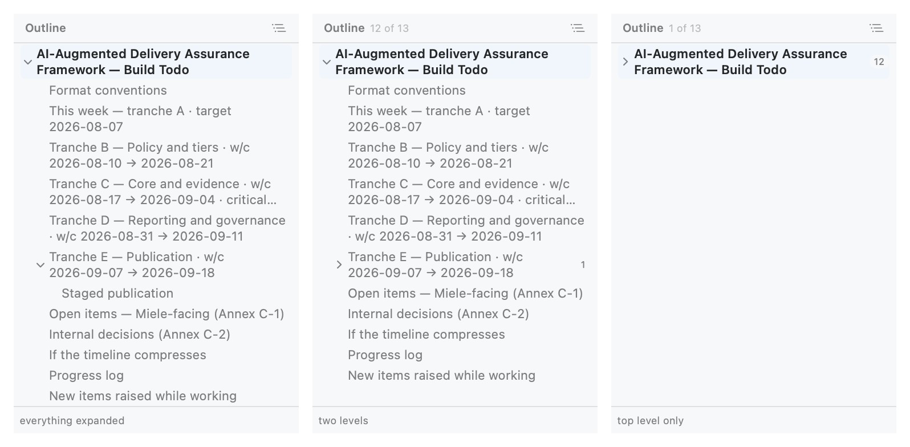
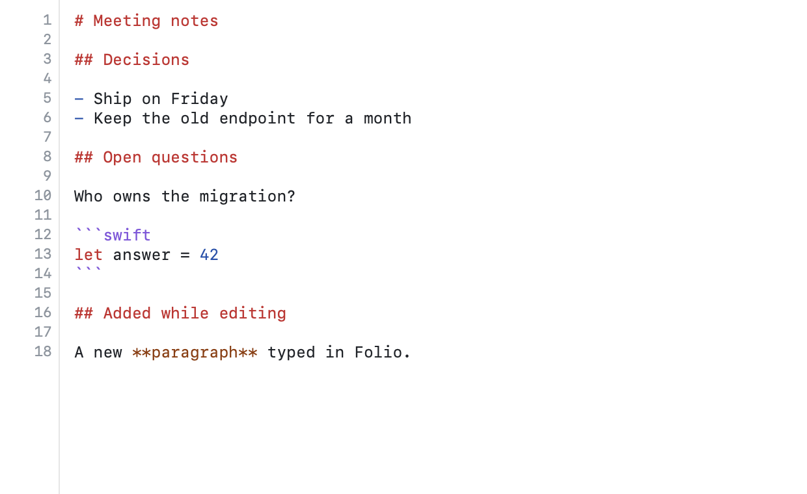

# Folio

**A native macOS viewer for diffs and Markdown, with a Markdown editor when you want one.**
Patches side by side with the original, Markdown rendered with its mermaid diagrams drawn,
and a source editor that saves when you tell it to — one window, with tabs, and offline
unless you press Push.

[](https://github.com/rwijnen/folio-viewer/actions/workflows/ci.yml)
[](LICENSE)
[](INSTALL.md#requirements)
[](INSTALL.md#requirements)
[-brightgreen)](THIRD-PARTY-NOTICES.md)
[](#how-this-was-built)

> **Written by an AI.** Folio was vibecoded — see [How this was built](#how-this-was-built)
> for who did what, and what that means for the code you are about to run.

```bash
git clone https://github.com/rwijnen/folio-viewer.git
cd folio-viewer && ./build.sh --set-default
```

Ten seconds, no Xcode needed — the Command Line Tools are enough. Full detail in
[INSTALL.md](INSTALL.md).

---

## Diffs


The right-hand panel is not read from anywhere: Folio reads the original from disk and
**applies the patch in memory**.

| | |
|---|---|
| Split view | Rows aligned line-for-line, per-side line numbers, filler cells for one-sided changes |
| Multi-file diffs | Sidebar with every file, `+`/`−` counts, add / delete / rename / binary badges |
| Intra-line word diff | The exact tokens that changed, not just the whole line |
| Collapsed context | Runs of more than 12 unchanged lines fold into a bar you can expand |
| Fuzzy patching | Hunks are found by content, so a diff still applies after the file has drifted; offsets are reported in a banner |
| Works from either side | If the file on disk is the *changed* version — the usual case once a patch has been applied — the patch runs **backwards** to reconstruct the original |
| Graceful fallback | If neither direction applies, the hunks are shown on their own rather than failing |
| Formats | `git diff`, `git format-patch`, `diff -u`, `svn diff`, including renames, mode changes and zero-context hunks |


**Finding the originals.** Diff paths are relative, so Folio works out which folder they
belong to: a remembered folder for that diff, the enclosing git working copy, the diff's
own folder and its ancestors, then one level of subfolders — the common
`~/Downloads/fix.diff` + `~/Downloads/project/` case. Override per diff with ⇧⌘B, or per
file with **Locate Original…**.

## Markdown


Mermaid diagrams are drawn inline, following the window's appearance:


⌘2 shows exactly what is in the file, with structure highlighted and fenced code lexed as
whatever language it declares:


The outline folds, so a long document's shape fits on one screen — per section, or the
whole thing down to one, two or three levels:



### Editing

Source mode is an editor, not a listing. Type, and the tab shows a dot, the header shows
**Edited**, and the Save button lights up — ⌘S writes the file, and nothing else ever does:



Switching to the preview (⌘1) shows what you have typed, not what is on disk. Saving
re-parses the document, so the outline and the rendered page follow along. Closing a tab
or quitting with unsaved work asks first, reloading from disk asks before discarding, and
if the file changed underneath you since you opened it, saving asks before overwriting
someone else's work. **Diffs and other text files stay read-only.**

| | |
|---|---|
| Rendered / Source | ⌘1 and ⌘2, or the toolbar switch |
| Markdown support | ATX and setext headings, nested ordered/unordered/task lists, pipe tables with alignment, blockquotes, fenced and indented code, thematic breaks, reference links, images, autolinks, emphasis, strikethrough, inline code, hard breaks |
| Diagrams | Every ` ```mermaid ` fence is drawn by mermaid 11, bundled in the app. One that fails to parse shows mermaid's error next to its own source instead of vanishing |
| Code fences | Highlighted by the same lexer the diff panels use, across ~30 languages |
| Outline | Sidebar built from the headings; click to jump, in either mode. **Foldable section by section** — collapse an `H1` and everything under it goes with it, or fold the whole document to one, two or three levels so a long file fits on one screen. ⌥-click a triangle for the whole subtree |
| Images | Local ones inlined as `data:` URIs; remote ones reported, never fetched |
| Follows links | Sibling `.md` / `.diff` files open in Folio; http(s) goes to your browser |
| **Editing** | Source mode is a real editor — undo, find, line numbers, live syntax colouring — and ⌘S writes the file. Nothing is ever auto-saved |
| **Git** | The header shows the branch, how far it has drifted, and whether this file has changes. ⌥⌘C commits it; ⌥⌘P pushes. One file per commit |

### Git

A Markdown document that lives in a git repository gets a pill in the header: the branch,
`↑`/`↓` for commits to push and pull, and a coloured dot when the file has changes. Behind
it are the only two things Folio will do to your repository.

**Commit** opens a sheet with a message field. Unsaved edits are saved first — git records
what is on disk, so committing without saving would quietly store the wrong version — and
then exactly one file is committed: the one you are looking at. Anything else you have
staged in a terminal stays staged and uncommitted.

**Push** sends the current branch to the upstream it already tracks. There is no force, no
`--set-upstream`, and no pull, rebase or merge. If the push is rejected because someone
else got there first, Folio says so and stops; the commit is already safely made, and
resolving it is a terminal job.

Folio shells out to the `git` on your machine rather than linking a library, so your
`~/.gitconfig`, credential helper, SSH agent, hooks and signing key all apply. A commit
Folio makes is indistinguishable from one you made yourself. It will not commit when
`user.name` and `user.email` are unset, when `HEAD` is detached, when the file is ignored,
or when a merge is unresolved — the menu says which.

## Tabs


Every document gets a tab in the one window. Each keeps **its own** reading mode, folds,
scroll position and search results, so switching away and back resumes exactly where you
were — and a rendered page keeps its already-drawn diagrams rather than re-drawing them.
Opening a file that is already open brings its tab forward, and tabs can be **dragged
into any order**. The underline says whether a tab holds a diff (orange), Markdown (blue)
or plain source (grey).

**Folio reopens where you left off.** Quit with documents open and they come back next
launch — same order, same one in front, same reading mode and scroll position. Only the
document you were reading is loaded at startup; the rest fill themselves in the moment you
click them, so a full set of tabs costs about 50 ms rather than a second.

## Find

⌘F searches the diff panels and the source view natively; in rendered mode it searches the
laid-out page through injected JavaScript. Both report `n of m`, step with ⌘G / ⇧⌘G, and
expand a collapsed fold to reveal a hit.

## Shortcuts

| | | | |
|---|---|---|---|
| ⌘O | Open (one or many) | ⌘F · ⌘G · ⇧⌘G | Find · next · previous |
| ⌘W | Close tab | ⌘] / ⌘[ | Next / previous file in a diff |
| ⌃⇥ / ⌃⇧⇥ | Next / previous tab | ⇧⌘B | Choose a diff's base folder |
| ⌘1 / ⌘2 | Rendered / source | ⇧⌘L | Wrap or scroll long lines |
| ⌘R | Reload from disk (right-click also offers it) | ⇧⌘E / ⇧⌘K | Expand / collapse all context |
| ⌘S / ⌥⌘S | Save · save all | ⌥⌘C / ⌥⌘P | Commit this file · push the branch |

## Why it is safe to point at a file someone sent you

Folio is built on three rules, and they are tested:

1. **It writes only what you ask it to, and only where it came from.** Diffs are never
   written: the patch is applied in memory to produce the right-hand panel, and there is
   no save path for them at all. Markdown you have opened can be edited and saved to that
   same file with ⌘S — explicitly, never automatically, never anywhere else. A commit
   records that one file and nothing else.
2. **It goes online only when you press Push.** Nothing else in Folio opens a connection:
   no telemetry, no update check, no remote images, no fonts, nothing at build time.
   mermaid is vendored so diagrams work offline. Push is the single exception, it is
   always a button you pressed, and it sends your branch to the remote your repository
   already points at.
3. **It does not execute what it renders.** Raw HTML in Markdown is escaped except a
   whitelist of attribute-free formatting tags, `javascript:` URLs are stripped, and the
   rendered page runs under `default-src 'none'; connect-src 'none'` with a per-load nonce
   that admits only the bundled mermaid bootstrap.

More in [SECURITY.md](SECURITY.md), including what a downloaded build cannot prove about
its publisher.

## Try it

```bash
open -a build/Folio.app Samples/example.md      # Markdown, three diagrams (one deliberately broken)
open -a build/Folio.app Samples/example.diff    # a real git diff plus the files it applies to
```

The diff sample covers a modified JSON file, a two-hunk Swift file with a long foldable
region, an added file and a deleted file. The Markdown sample exercises every construct the
renderer supports.

## Documentation

| | |
|---|---|
| [INSTALL.md](INSTALL.md) | Requirements, building, file associations, Gatekeeper, uninstalling, troubleshooting |
| [Docs/ARCHITECTURE.md](Docs/ARCHITECTURE.md) | Why the interesting parts are built the way they are |
| [CONTRIBUTING.md](CONTRIBUTING.md) | Development setup, tests, how to verify UI without Xcode, common tasks |
| [SECURITY.md](SECURITY.md) | Threat model and how to report a vulnerability |
| [CHANGELOG.md](CHANGELOG.md) | What changed, and when |

## Built with nothing much

No package manager, no framework, one vendored dependency. `swift build` and a shell
script that assembles the bundle and draws the icon with Core Graphics — the whole thing
compiles with the Command Line Tools alone. 231 tests run in about fifteen seconds.

Contributions are welcome; please read [CONTRIBUTING.md](CONTRIBUTING.md) first, since
Folio's narrow-writing, offline, non-executing constraints are deliberate.

## How this was built

Folio was **vibecoded**. Essentially all of its code, tests, icon and documentation were
written by Claude (Opus 5) in [Claude Code](https://claude.com/claude-code), from prompts
by [@rwijnen](https://github.com/rwijnen), who set out what the app should do, made the
product decisions — scope, name, licence, what to leave out — ran each build, and reported
what was wrong with it. Every commit carries a `Co-Authored-By: Claude` trailer, so
`git log` shows exactly which parts that covers: all of them.

This is stated plainly because you should know what you are reading before you trust it.
It does not lower the bar the code has to clear:

- The 231 tests are real tests over real fixtures, and CI runs them on every push.
- The three rules above — writes only where you ask, online only on Push, never executes
  what it renders — are the ones under test, not just claims in a README. The git tests
  build throwaway repositories and push between them on disk, so the narrowness is
  measured rather than asserted: one of them stages a second file by hand and checks the
  commit left it alone.
- Several of them were tightened only after a test or a measurement contradicted the first
  attempt: a search that counted 131 CSS rules as document matches, a menu whose disabled
  items silently swallowed their keyboard shortcuts, a session restore that cost a second
  at launch until it was made lazy. [Docs/ARCHITECTURE.md](Docs/ARCHITECTURE.md) records
  the reasoning behind the parts that ended up unusual.
- The screenshots are rendered from the app's own view code, not mock-ups.

What it does not mean: that anyone else has audited this. Machine-written code is still
code, with the ordinary risk of being confidently wrong in a way its author did not think
to test. It is small, commented, and MIT-licensed precisely so you can read it before
pointing it at anything that matters — and [issues](https://github.com/rwijnen/folio-viewer/issues)
about anything it gets wrong are welcome.

## Licence and credits

[MIT](LICENSE) © 2026 Robin Wijnen.

Diagram rendering by [mermaid](https://github.com/mermaid-js/mermaid) (MIT), vendored —
see [THIRD-PARTY-NOTICES.md](THIRD-PARTY-NOTICES.md). Colours follow GitHub's diff and
Markdown palettes.

The screenshots above are rendered from the app's own view code offscreen, because the
machine Folio was built on has no screen-recording permission; they show real output,
without the surrounding window chrome.
