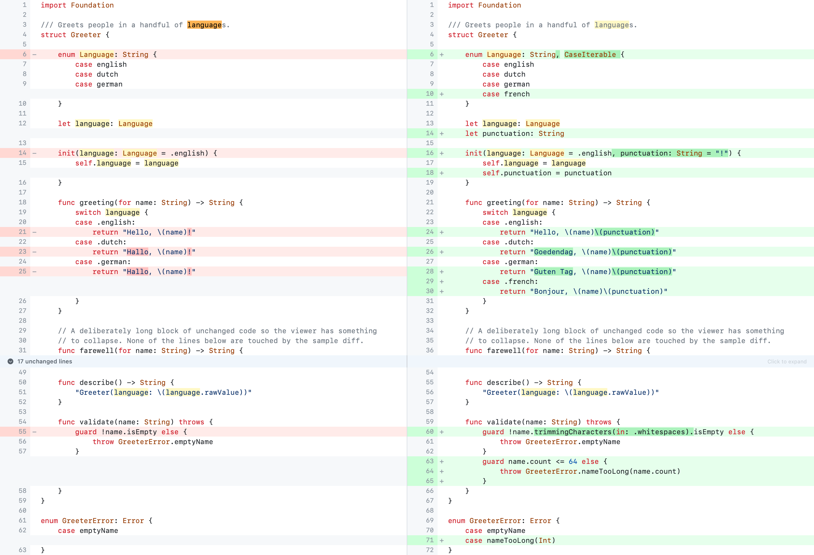
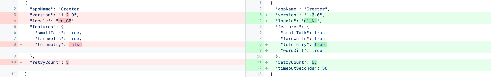
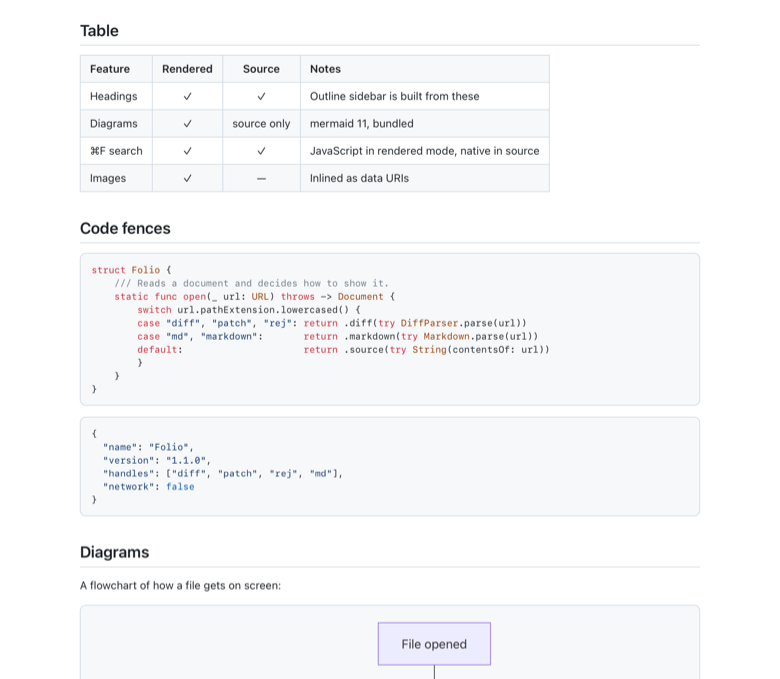
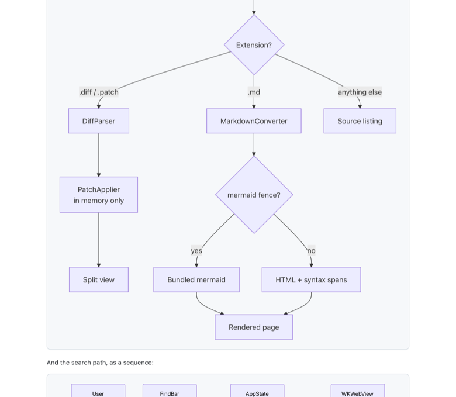
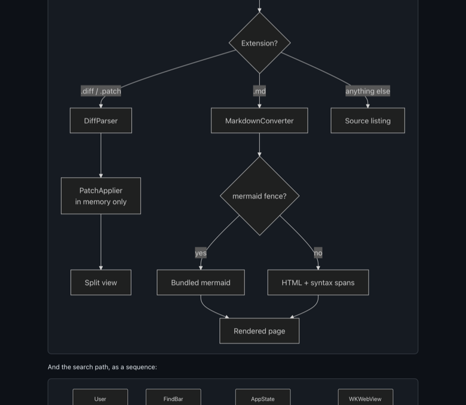
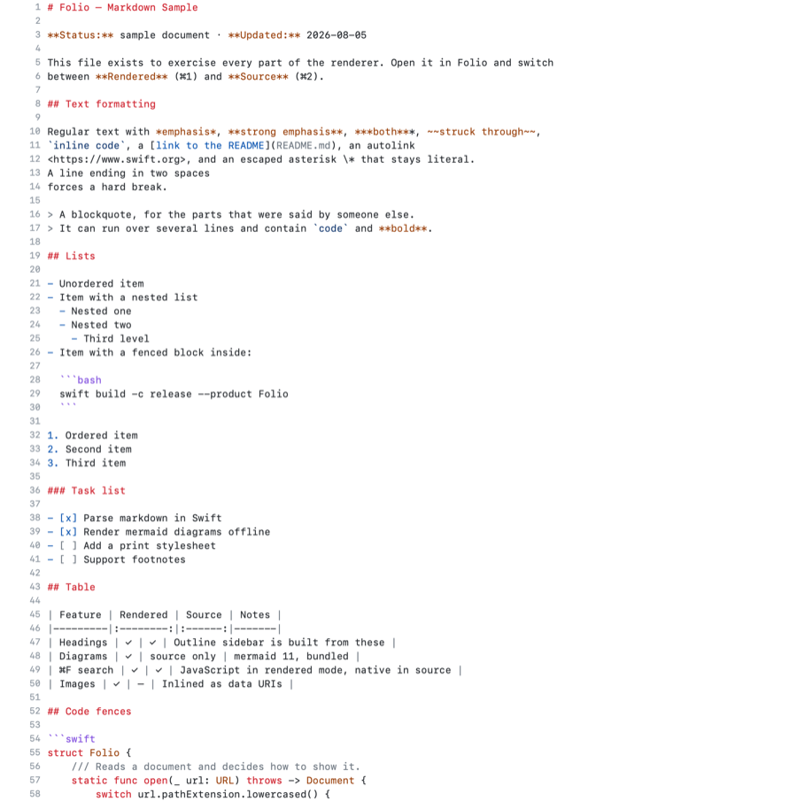
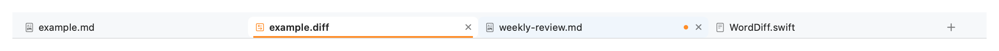

# Folio

**A native macOS viewer for diffs and Markdown.** Patches side by side with the original,
Markdown rendered with its mermaid diagrams drawn — in one window, with tabs, without ever
writing to your files or touching the network.

[](https://github.com/rwijnen/folio-viewer/actions/workflows/ci.yml)
[](LICENSE)
[](INSTALL.md#requirements)
[](INSTALL.md#requirements)
[-brightgreen)](THIRD-PARTY-NOTICES.md)

```bash
git clone https://github.com/rwijnen/folio-viewer.git
cd folio-viewer && ./build.sh --set-default
```

Ten seconds, no Xcode needed — the Command Line Tools are enough. Full detail in
[INSTALL.md](INSTALL.md).

---

## Diffs



The right-hand panel is not read from anywhere: Folio reads the original from disk and
**applies the patch in memory**.

| | |
|---|---|
| Split view | Rows aligned line-for-line, per-side line numbers, filler cells for one-sided changes |
| Multi-file diffs | Sidebar with every file, `+`/`−` counts, add / delete / rename / binary badges |
| Intra-line word diff | The exact tokens that changed, not just the whole line |
| Collapsed context | Runs of more than 12 unchanged lines fold into a bar you can expand |
| Fuzzy patching | Hunks are found by content, so a diff still applies after the file has drifted; offsets are reported in a banner |
| Works from either side | If the file on disk is the *changed* version — the usual case once a patch has been applied — the patch runs **backwards** to reconstruct the original |
| Graceful fallback | If neither direction applies, the hunks are shown on their own rather than failing |
| Formats | `git diff`, `git format-patch`, `diff -u`, `svn diff`, including renames, mode changes and zero-context hunks |



**Finding the originals.** Diff paths are relative, so Folio works out which folder they
belong to: a remembered folder for that diff, the enclosing git working copy, the diff's
own folder and its ancestors, then one level of subfolders — the common
`~/Downloads/fix.diff` + `~/Downloads/project/` case. Override per diff with ⇧⌘B, or per
file with **Locate Original…**.

## Markdown



Mermaid diagrams are drawn inline, following the window's appearance:




⌘2 shows exactly what is in the file, with structure highlighted and fenced code lexed as
whatever language it declares:



| | |
|---|---|
| Rendered / Source | ⌘1 and ⌘2, or the toolbar switch |
| Markdown support | ATX and setext headings, nested ordered/unordered/task lists, pipe tables with alignment, blockquotes, fenced and indented code, thematic breaks, reference links, images, autolinks, emphasis, strikethrough, inline code, hard breaks |
| Diagrams | Every ` ```mermaid ` fence is drawn by mermaid 11, bundled in the app. One that fails to parse shows mermaid's error next to its own source instead of vanishing |
| Code fences | Highlighted by the same lexer the diff panels use, across ~30 languages |
| Outline | Sidebar built from the headings; click to jump, in either mode |
| Images | Local ones inlined as `data:` URIs; remote ones reported, never fetched |
| Follows links | Sibling `.md` / `.diff` files open in Folio; http(s) goes to your browser |

## Tabs



Every document gets a tab in the one window. Each keeps **its own** reading mode, folds,
scroll position and search results, so switching away and back resumes exactly where you
were — and a rendered page keeps its already-drawn diagrams rather than re-drawing them.
Opening a file that is already open brings its tab forward. The underline says whether a
tab holds a diff (orange), Markdown (blue) or plain source (grey).

## Find

⌘F searches the diff panels and the source view natively; in rendered mode it searches the
laid-out page through injected JavaScript. Both report `n of m`, step with ⌘G / ⇧⌘G, and
expand a collapsed fold to reveal a hit.

## Shortcuts

| | | | |
|---|---|---|---|
| ⌘O | Open (one or many) | ⌘F · ⌘G · ⇧⌘G | Find · next · previous |
| ⌘W | Close tab | ⌘] / ⌘[ | Next / previous file in a diff |
| ⌃⇥ / ⌃⇧⇥ | Next / previous tab | ⇧⌘B | Choose a diff's base folder |
| ⌘1 / ⌘2 | Rendered / source | ⇧⌘L | Wrap or scroll long lines |
| ⌘R | Reload from disk (right-click also offers it) | ⇧⌘E / ⇧⌘K | Expand / collapse all context |

## Why it is safe to point at a file someone sent you

Folio is built on three rules, and they are tested:

1. **It never writes to the files it opens.** Patches are applied in memory; there is no
   save path.
2. **It never uses the network.** Not at build time, not at run time. mermaid is vendored
   so diagrams work offline.
3. **It does not execute what it renders.** Raw HTML in Markdown is escaped except a
   whitelist of attribute-free formatting tags, `javascript:` URLs are stripped, and the
   rendered page runs under `default-src 'none'; connect-src 'none'` with a per-load nonce
   that admits only the bundled mermaid bootstrap.

More in [SECURITY.md](SECURITY.md), including what a downloaded build cannot prove about
its publisher.

## Try it

```bash
open -a build/Folio.app Samples/example.md      # Markdown, three diagrams (one deliberately broken)
open -a build/Folio.app Samples/example.diff    # a real git diff plus the files it applies to
```

The diff sample covers a modified JSON file, a two-hunk Swift file with a long foldable
region, an added file and a deleted file. The Markdown sample exercises every construct the
renderer supports.

## Documentation

| | |
|---|---|
| [INSTALL.md](INSTALL.md) | Requirements, building, file associations, Gatekeeper, uninstalling, troubleshooting |
| [Docs/ARCHITECTURE.md](Docs/ARCHITECTURE.md) | Why the interesting parts are built the way they are |
| [CONTRIBUTING.md](CONTRIBUTING.md) | Development setup, tests, how to verify UI without Xcode, common tasks |
| [SECURITY.md](SECURITY.md) | Threat model and how to report a vulnerability |
| [CHANGELOG.md](CHANGELOG.md) | What changed, and when |

## Built with nothing much

No package manager, no framework, one vendored dependency. `swift build` and a shell
script that assembles the bundle and draws the icon with Core Graphics — the whole thing
compiles with the Command Line Tools alone. 118 tests run in about five seconds.

Contributions are welcome; please read [CONTRIBUTING.md](CONTRIBUTING.md) first, since
Folio's read-only, offline, non-executing constraints are deliberate.

## Licence and credits

[MIT](LICENSE) © 2026 Robin Wijnen.

Diagram rendering by [mermaid](https://github.com/mermaid-js/mermaid) (MIT), vendored —
see [THIRD-PARTY-NOTICES.md](THIRD-PARTY-NOTICES.md). Colours follow GitHub's diff and
Markdown palettes.

The screenshots above are rendered from the app's own view code offscreen, because the
machine Folio was built on has no screen-recording permission; they show real output,
without the surrounding window chrome.
