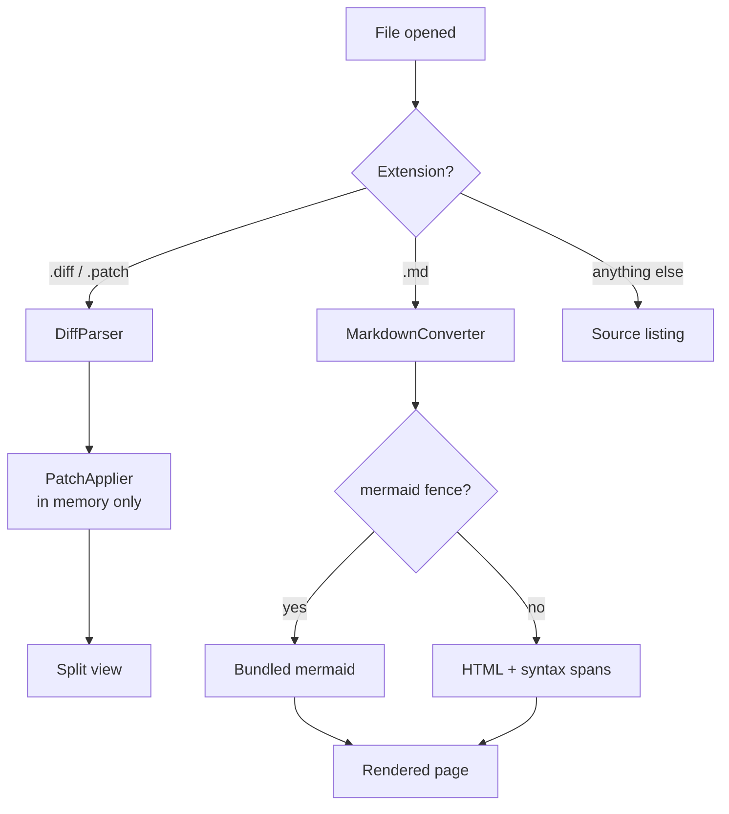
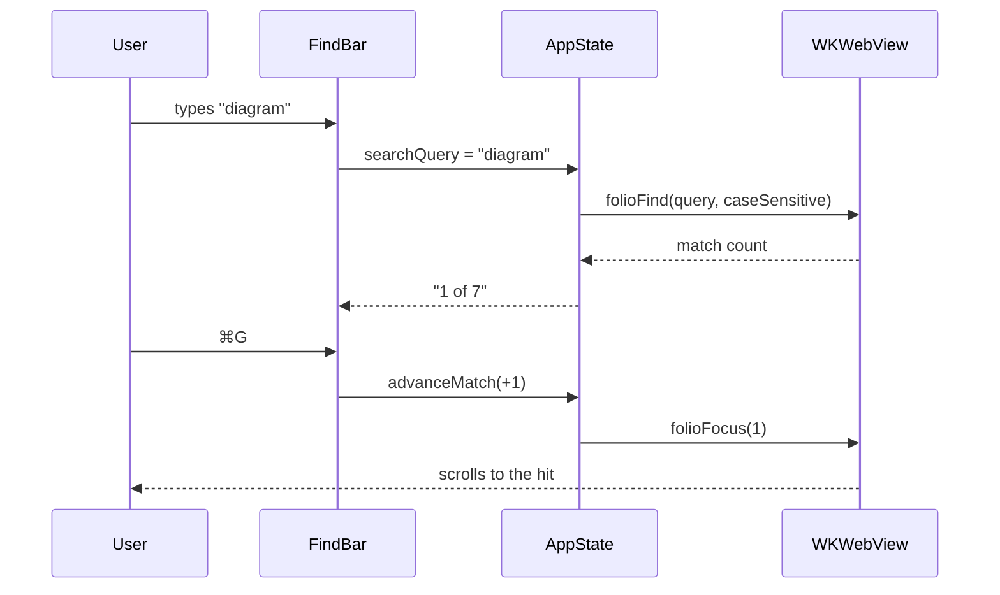

# Folio — Markdown Sample

**Status:** sample document · **Updated:** 2026-08-05

This file exists to exercise every part of the renderer. Open it in Folio and switch
between **Rendered** (⌘1) and **Source** (⌘2).

## Text formatting

Regular text with *emphasis*, **strong emphasis**, ***both***, ~~struck through~~,
`inline code`, a [link to the README](README.md), an autolink
<https://www.swift.org>, and an escaped asterisk \* that stays literal.
A line ending in two spaces  
forces a hard break.

> A blockquote, for the parts that were said by someone else.
> It can run over several lines and contain `code` and **bold**.

## Lists

- Unordered item
- Item with a nested list
  - Nested one
  - Nested two
    - Third level
- Item with a fenced block inside:

  ```bash
  swift build -c release --product Folio
  ```

1. Ordered item
2. Second item
3. Third item

### Task list

- [x] Parse markdown in Swift
- [x] Render mermaid diagrams offline
- [ ] Add a print stylesheet
- [ ] Support footnotes

## Table

| Feature | Rendered | Source | Notes |
|---------|:--------:|:------:|-------|
| Headings | ✓ | ✓ | Outline sidebar is built from these |
| Diagrams | ✓ | source only | mermaid 11, bundled |
| ⌘F search | ✓ | ✓ | JavaScript in rendered mode, native in source |
| Images | ✓ | — | Inlined as data URIs |

## Code fences

```swift
struct Folio {
    /// Reads a document and decides how to show it.
    static func open(_ url: URL) throws -> Document {
        switch url.pathExtension.lowercased() {
        case "diff", "patch", "rej": return .diff(try DiffParser.parse(url))
        case "md", "markdown":       return .markdown(try Markdown.parse(url))
        default:                     return .source(try String(contentsOf: url))
        }
    }
}
```

```json
{
  "name": "Folio",
  "version": "1.1.0",
  "handles": ["diff", "patch", "rej", "md"],
  "network": false
}
```

## Diagrams

A flowchart of how a file gets on screen:



And the search path, as a sequence:



A deliberately broken diagram, to show the error path:

```mermaid
flowchart TD
    A[Unclosed bracket --> B
```

## Horizontal rule

---

That is the end of the sample.
